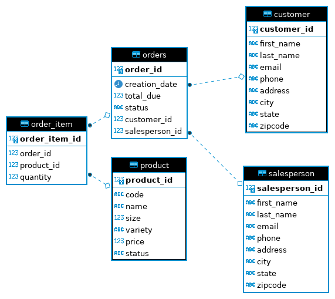

# Introduction
The *Java JDBC* is an application that allows to perform Create Read Update Delete (CRUD) 
operations on the data of customers and their orders. Effectively, the application serves 
as an interface between the object oriented design in Java and the data persisted in 
in SQL database in relational form.

The project is written in `Java`, utilizing `JDBC` API to manage the database
connection and operations. The `PostgreSQL` database is used which 
is running in `docker`. `Maven` is used for dependency management, and the project
is developed following GitFlow methodology using `GitHub` as a repository.

# Implementaiton
## ER Diagram

## Design Patterns

### Data Access Object (DAO) Pattern
DAO pattern is an interface for data persistence with a focus 
on atomicity of relational operations and delegation of logic to SQL queries. The DAO pattern 
links the business logic and corresponding relational data. 
It operates with the object-oriented code 
through the Data Transfer Objects (DTOs) that represent the state 
of some business entities and maps them to the relations (tables) in the database.

The DAO is selected in this implementation, since the database has normalized relations
which allow to perform SQL operations efficiently.
To follow the DAO pattern, a DTO class is been defined for each relation in the table
(`Customer`, `Order`, `OrderItem`, etc.). Then, the database operations are implemented 
in `CustomerDAO` and `OrderDAO` classes.

### Repository Pattern
The Repository pattern is another approach to the data persistence. While from the user's
perspective it can be similar to the DAO pattern, the Repository pattern is often
used in the distributed systems. The Repository is usually implemented as a single 
large table containing for a class and performs the business logic directly in code, 
rather then through SQL queries.

The Repository pattern is most  applicable in database constrained applications 
that benefit from horizontal scaling. In such case, the data tables are often 
denormalized and can be sharded and distributed accordingly, which can mean higher 
availability and partition tolerance. 
However, these benefits come at the cost of potential data inconsistency, since atomic operations
become hard or even impossible.

# Test
Setup of the PostgreSQL in a docker container and execution of test data scripts (`./sql`) 
is done similarly, as described in 
[Quick Start](https://github.com/jarviscanada/jarvis_data_eng_AlexKirilenko/tree/develop/linux_sql#quick-start).
The correctness of implementation is tested by comparing the output of the *Java JDBC*
with the results obtained running corresponding SQL queries in `DBeaver` and ensuring
that the state of the tables is correct.