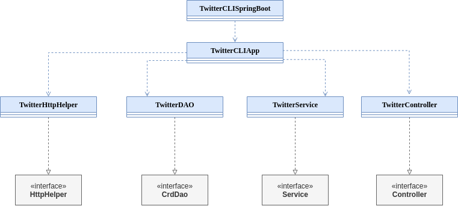

# Introduction
The *Twitter API* app is a command line tool that allows to 
post/show/delete tweets and can be used as a component of a larger app.
The application is written in Java. It relies on the Apache HTTPComponents library to 
interact with the Twitter REST API, and Spring Boot is used to manage object dependencies.
Additionally, Jackson library is used for JSON processing.
The project lifecycle (including packaging, and unit and integration testing) and its dependencies 
are managed through Maven. Docker is used to build an easily distributable
image of the app which is uploaded to the Docker Hub.


# Quick Start
To run the app:
1. Pull and image from the docker hub:
    ```Bash
    $ docker pull akirilenko200/twitter_app
    ```
2. Run the application image <a id="using_image"></a>:
    ```Bash
    $ docker run --rm \
    -e consumerKey=VALUE \
    -e consumerSecret=VALUE \
    -e accessToken=VALUE \
    -e tokenSecret=VALUE \
    akirilenko200/twitter_app post|show|delete [options]
    ```
    here, environment variables refer to the OAuth keys generated by the Twitter.
   Then, the following options can be used:
    1. *Post* a tweet with given text and coordinates and display its content: 
       ```shell
       post "tweet_text" "longitude:latitude"
       ```
    2. _Show_ a tweet with given `id` and, optionally, selected fields:
        ```shell
        show id ["field1,field2,..."]
        ```
       if no fields are selected, the whole tweet JSON is displayed.
    3. _Delete_ one or more tweets by their `id` and display their content:
        ```shell
        delete "id1,id2,..."
       ```

# Design
The application is designed to follow the MVC architecture by separating the functionality 
into separate classes and creating a hierarchy of interaction between them.
## UML diagram

* **TwitterCLISPringBoot**:
    This class is a wrapper of the application for the Spring Boot to enable automatic 
  wiring of dependencies. 
  It acts as an entrypoint for the whole application by accepting and transferring
  the command-line arguments to the **TwitterCLIApp**.
  
* **TwitterCLIApp**: This class acts as a view component. It processes the  command line input
  arguments and issues the appropriate commands to the controller level. 
  It is also responsible for display of the results.
  
* **TwitterController**: This is a controller class that parses the input arguments into the 
    commands for the business logic level.
  
* **TwitterService**: This class is a model component that implements the business logic 
    of validating of the inputs and calling the data-access layer of the application.
  
* **TwitterDAO**: This class implements the data-access interface by creating the
    URI of the corresponding request and passing it to the HTTP Client implementation. 
  It also builds the Model objects from the HTTP responses.
  
* **TwitterHttpHelper**: This class handles the actual HTTP communication. It processes the 
  URIs into HTTP requests and receives the responses.
  
## Models
The **Tweet** class is defined as the DTO that is used throughout the application 
to transfer the tweet information between the layers. Internally, it is implemented
with several subclasses (**Coordinates** and **Entities**) and object wrappers 
of primitive fields (e.g. `Integer` instead of `int`). This ensures proper serialization
and deserialization of JSON objects.

## Spring
In this app, the object lifecycle is managed through the Spring container, otherwise known 
as Inversion of Control (IoC). Thus, the Spring container scans the classes for 
the `@Component` and `@Bean` annotations. Then, it creates and supplies 
singleton instances of these classes into the 
constructors with the `@Autowired` annotation, when the later are called. 

This is in contrast with the conventional dependency management, where one or more 
classes create and manage their own or each other's dependencies. 
Consequently, using IoC framework allows to simplify and decouple the object lifecycle 
management from the application logic and enables the applications to scale.

# Test
To ensure that the application performs according to the specifications,
unit and integration tests are created for each component using JUnit testing suite.
This way, unit tests verify that components work in isolation, by mocking their
dependencies using Mockito. Furthermore, integration tests demonstrate that the system 
functions as expected by querying the actual Twitter API and verifying the responses.

## Deployment
1. The Dockerfile is used to create the image:
    ```shell
    FROM openjdk:8-alpine
    COPY target/TwitterCRUD-1.0-SNAPSHOT.jar /usr/app/
    WORKDIR /usr/app
    ENTRYPOINT ["java", "-jar", "TwitterCRUD-1.0-SNAPSHOT.jar"]
    ```
   Here, the base image is `openjdk:8-alpine` which contains Alpine Linux distribution
   with OpenJDK 8. Copy specifies which files are to be copied to the image.
   Entrypoint specifies how the application is started in the container.

2. The image is built by executing the Dockerfile:
    ```Bash
        docker build -t akirilenko200/twitter_app .
    ```
   Here, `-t` argument specifies the tag (name) of the image, and the image
   is built from the current directory(`.`).


3. The image is pushed to the Docker Hub:
    ```Bash
        docker push akirilenko200/twitter_app
    ```

4. [Pull and run the image.](#using_image)
# Improvements
- Extra functionality available in the Twitter API can be added, including the text and
  hashtag search.
- Local caching of tweets can be implemented, for example, with an in-memory database.
- An extra parameter can be added to post long messages split into several tweets.