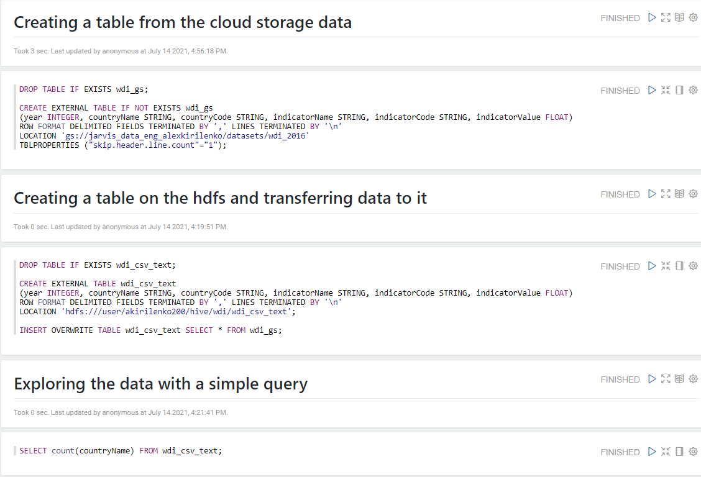
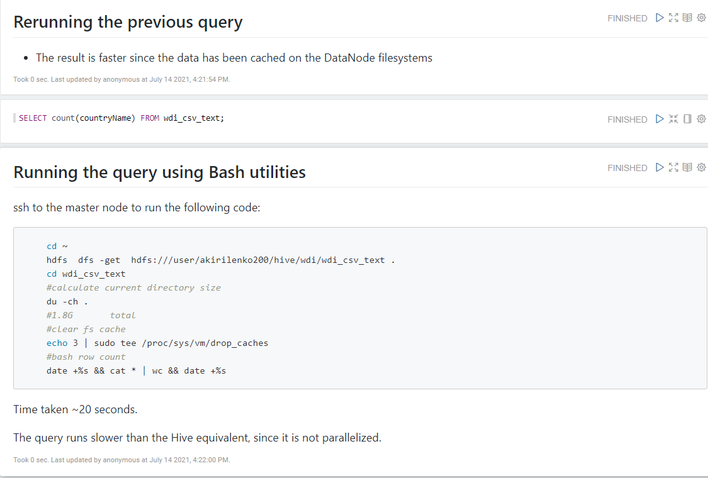
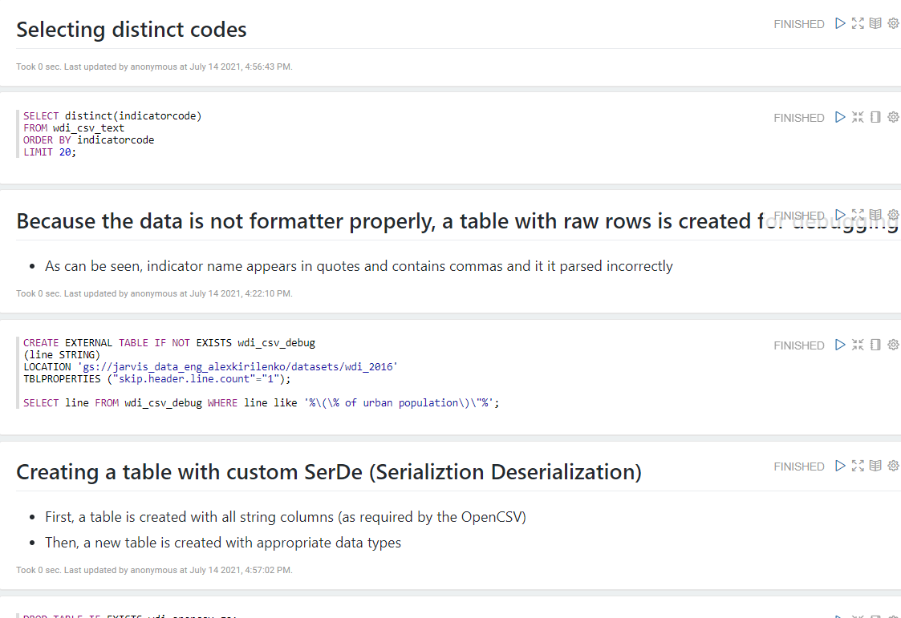
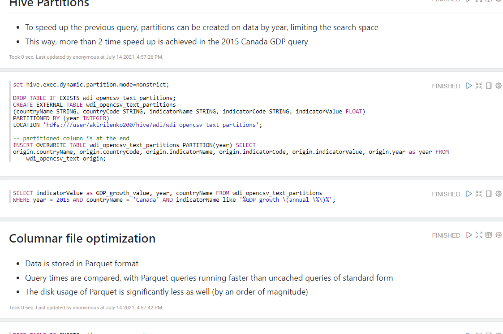
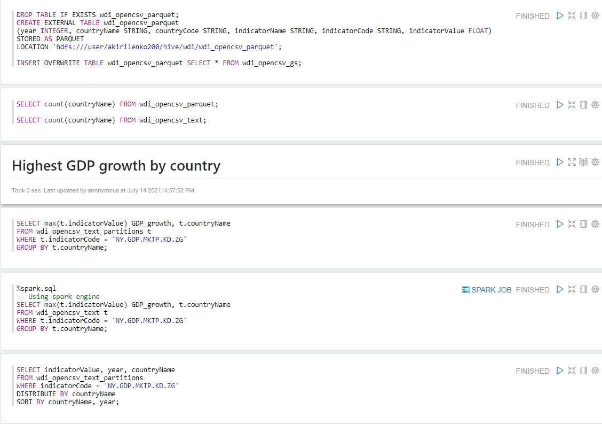

Table of contents
* [Introduction](#introduction)
* [Hadoop Cluster](#hadoop-cluster)
* [Hive Project](#hive-project)
* [Improvements](#improvements)

# Introduction
The goal of this project is to analyze big data solutions of the hadoop distributed ecosystem. 
A hadoop cluster was deployed on the Google Cloud Platform (GCP), 
including HDFS, YARN and Hive services. 
Then, the 2016 World Development Indicators dataset was loaded and transformed into the appropriate format.
The project delivers a Zeppelin Notebook that
executes the data analytics queries through Apache Hive and can be used as a convenient interface.

# Hadoop Cluster
Hadoop cluster is set up using GCP Dataproc service and has 1 master and 2 worker nodes.
Every node has 2 vCPUs, 12 GBs of memory and 100 GB hard drives.

The following Hadoop components are used in this project:

1. HDFS (Hadoop distributed file system): manages the files by splitting them in 
   blocks and distributes the replicas on the cluster nodes. 
   It follows the master-worker architecture with a NameNode controlling DataNodes 
   that hold the actual file blocks. 
   HDFS can be interacted with through the `hdfs` command-line tool.

2. YARN (yet another resource negotiator): 
   a resource manager that is responsible for scheduling jobs on top of the HDFS.
   It consists of the Resource Manager on the master node and Node Managers on the worker nodes.
   The jobs are executed through the application master and containers located on the individual workers.

3. MapReduce: a process of distributed computation. Each assigned worker maps
  the input data into the key-value pairs, which are then distributed among different workers
   based on the keys and are finally reduced to the result, by applying some operation on them.

4. Hive: data warehouse layer operating on top of YARN and HDFS. It operates as a hive 
  server located on the master node, which stores the metadata about the managed data
   and schedules the execution of queries through the YARN.

5. Zeppelin Notebook: is a browser application that allows users to interact with
   the underlying data through the HQL. 

# Hive Project
The scripts are presented in the [notebook](hive/Jarvis_Hive_Project..ipynb):

Several points can be highlighted: 
- Due to the formatting of the original data it was necessary to use the 
custom Serialization-Deserialization (SerDe) to ensure that columns are parsed correctly.
- To optimize the search time, the data has been partitioned by year.
- To optimize the space usage, the data has been transformed into the columnar format (Parquet). 

# Improvements

- Explore the performance improvements due to horizontal scalability by adding more worker nodes
- Build a data pipeline to easily input data and deliver outputs
- Wrap most used queries into user defined functions