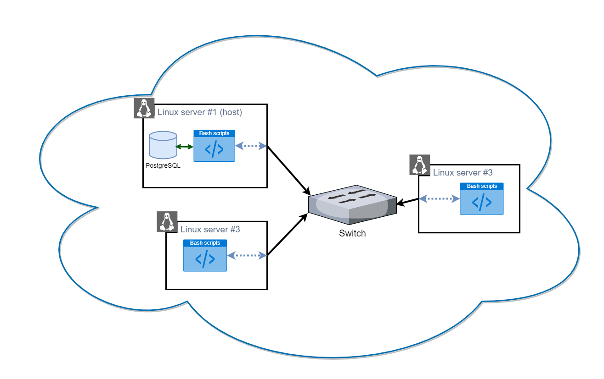

# Linux Cluster Monitoring Agent
## Introduction

*Linux Cluster Monitoring Agent* is a set of tools that allow 
to automate the collection and persistence of hosts data in a Linux cluster.
In particular, the hardware specifications and real-time usage data 
of hosts are collected and stored.

The project can be used by the system administrators and 
DevOps specialists to set up the monitoring process and to flexibly
manage hardware resources based on the load. Additionally, the collected
usage data can be used by system analysts to gain insights into 
potential challenges and opportunities.

The project is developed following the `Scrum` approach.  
The repository is hosted on `GitHub`, using `git` for version control
and `GitFlow` to manage project releases.
The main scripts are developed using `Bash` scripting language.
The data persistence is enabled through `PostgreSQL` server 
running as a containerized process using `Docker`.
The overall system is set up and running on `Centos 7` Linux distribution
virtual machine that is hosted by the `Google Cloud Platform (GCP)`.

## Quick Start
1. Assuming `docker` service is installed and running on the host, `psql_docker.sh`
   is used to manage a `PostgresSQL` server container (at the default port 5432):
   ```Bash
      bash ./scripts/psql_docker.sh start|stop|create [db_username][db_password]
    ```
2. Project database `host_agent`, and `host_info` and `host_usage` tables are created on
the host using the configuration file `ddl.sql`:
   ```Bash
      bash psql -h localhost -p 5432 -U db_username -f ./sql/ddl.sql
    ```
3. Hardware specifications are inserted into the database.
   Thus, for every machine (by specifying appropriate address instead of `localhost`):
    ```Bash
        bash ./scripts/host_info.sh localhost 5432 db_name db_username db_password
    ```
4. Real-time hardware usage data is inserted into the database. Thus, for every machine
   (by specifying appropriate address instead of `localhost`):
    ```Bash
        bash ./scripts/host_usage.sh localhost 5432 db_name db_username db_password
    ```
5. The usage data collection is automated by scheduling the execution 
   of the script every minute, using the `crontab` utility. 
   Thus, for every machine (by specifying appropriate address instead of `localhost`):
   ```Bash
      crontab -e
      * * * * * bash ~full_path~/scripts/host_usage.sh localhost 5432 host_agent postgres password > /tmp/host_usage.log
   ```

## Implemenation
### Architecture
Each server in the cluster has `host_info.sh` and `host_usage.sh` scripts,
which insert the data to the host server database over the local network.
The host server is additionally responsible for the provision of the sql server 
and management of the database and tables through `psql_docker.sh` and `ddl.sql` scripts. 


### Scripts
- `psql_docker.sh`
  > This script controls the docker container with postgres server.
  > It is used for the creation of the server container and allows the user to start and stop it.
- `host_info.sh`
  > This script parses the hardware specifications of the machine it is run on, provided by the `lscpu` command.
  > Then, it inserts the data into the `host_info` table of the provided postgres server.
- `host_usage.sh`
  > This script parses the hardware usage data of the machine it is run on, provided by the `vmstat` and `df` commands.
  > Then, it inserts the data into the `host_info` table of the provided postgres server.
- `crontab`
  > This utility is used to schedule the execution of data collection scripts,
  > by adding the `host_usage.sh` into the crontab's list on every machine.
- `ddl.sql`
  > This script creates a `host_agent` database and creates the structure of tables. 
  > It is executed through the `psql` command. 
- `queries.sql` 
  > This script populate the created tables with test data.
  > Additionally, it demonstrates examples of business questions that can be answered with the collected data:
  > * Ordering existing servers by the number of CPUs and memeory amount;
  > * Displaying average memory use over time intervals of varying length for every machine.
  > * Identifying potential machine failures at times the server did not insert the data.
  
### Database Modeling
`host_info` table has the following structure:

Column Name | Data Type
----------- | -----------
 id         |      SERIAL PRIMARY KEY
 hostname   |      VARCHAR UNIQUE     NOT NULL
 cpu_number |      INTEGER
 cpu_architecture | VARCHAR
 cpu_model |       VARCHAR
 cpu_mhz   |       REAL
 L2_cache  |       INTEGER
 total_mem |       INTEGER
 timestamp |     TIMESTAMP

- `host_usage` table has the following structure:

Column Name | Data Type
----------- | -----------
 id | SERIAL PRIMARY KEY
 timestamp | TIMESTAMP NOT NULL
 host_id | INTEGER NOT NULL
 memory_free | INTEGER
 cpu_idle | INTEGER
 cpu_kernel | INTEGER
 disk_io | INTEGER
 disk_available | INTEGER
Additionally, a foreign key constraint is added to the `host_usage.host_id` column
with a reference to the `host_info.id`.

## Test
All scripts are written to fail-fast,
meaning if any of the inputs are not correct, the script will terminate.Each script in the developed project was tested manually by comparing the 
execution outcomes with the expected results:

1. The `psql_docker.sh` script was tested by verifying that the 
docker container with postgres sever was successfully created, 
started and stopped. 

2. The `ddl.sql` script was tested by verifying 
that corresponding database and tables are created in postgres server.

3. The `host_info.sh` and `host_usage.sh` scripts were tested by running them
and querying the corresponding tables to verify the insert operations. 
Similarly, the correct configuration of schedule `crontab` is verified 
by ensuring that a new entry is inserted every minute.
   
4. The `queries.sql` script was tested by generating synthetic data and 
running the queries on it.

## Improvements
While the project is fully functional,
there are several improvements that can be made:
- Add scripts for the common analytics features.
- Develop an API that would enable 
  to query the data without providing access to SQL.
- Add support for writing to several databases. 
  For example, real-time data can be stored in a temporary database, 
  while the hourly/daily/weekly summary can be persisted in a data vault.
