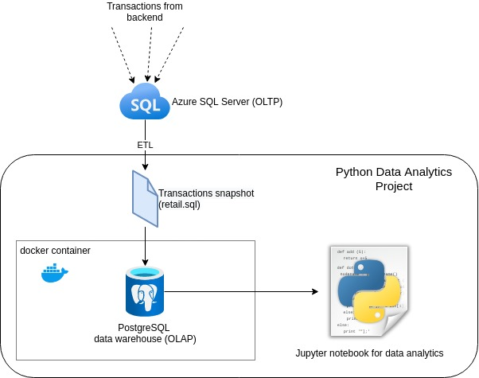

# Introduction
This project analyzes transactions data from a gift shop company from the perspective of aggregate sales statistics and customers' behavior. The project uses Python as the main language and relies on the Pandas, matplotlib and NumPy libraries. It is implemented in the form of a Jupyter notebook and relies on the data provided by an external source (e.g. postgres database or csv file).

The results of the project can be used to devise sale strategies and promotions aimed at each category of customers. 

# Implementaion
## Project Architecture

A copy of transactions archived from the gift shop company OLTP system was provided as the input. This data is stored in a postgres database and then extracted by Pandas for further analysis.

## Data Analytics and Wrangling

[Jupyter notebook](./python_data_wrangling/retail_data_analytics_wrangling.ipynb) contains the implementation of the data analytics: 

1. The data is loaded into Pandas dataframes and filtering is applied.
2. Explorational queries are performed to display the insignts about sales and customers in the graphical form.
3. The Recency Frequency Monetary (RFM) analysis is performed on customers.
4. Finally, customers are groupped into several categories, that describe their spending patterns and  importance to the business. 

Based on the RFM segmentation of customers, several conclusions can be made:
- The company should dedicate the most efforts at the _Champions_ as they have the highest scores in all categories and represent a sizeable size of the users. The _Loyal Customers_ group follows a similar pattern, with slightly less impactful scores. Customer appreciation events and personalized deals can be recommended as possible actions. 
- It is necessary to perform a more detailed analysis of the _Can't Lose_ and _At Risk_ customers and identify why they have not been active recently and what actions can be taken to spike their activity. This way, customer feedback should be collected before any significant actions are taken. 
- Finally, the _Potential Loyalists_ and _Need Attention_ groups should be given closer attention as they represent a sizeable share of the business. For example, targeted promotions could be implemented.

# Improvements
- Add treemap to visualize the share of customers in each RFM category
- Introduce machine learning models for predictive analytics
- Automate the loading of data from the company's OLTP system
