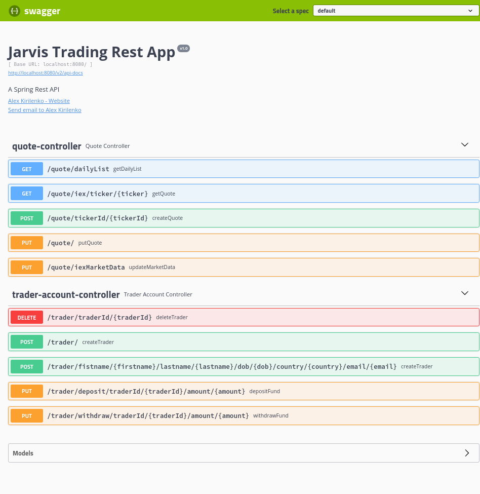
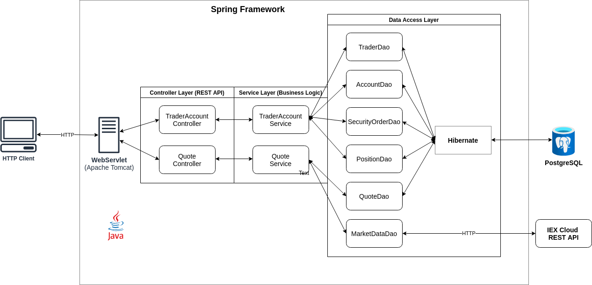
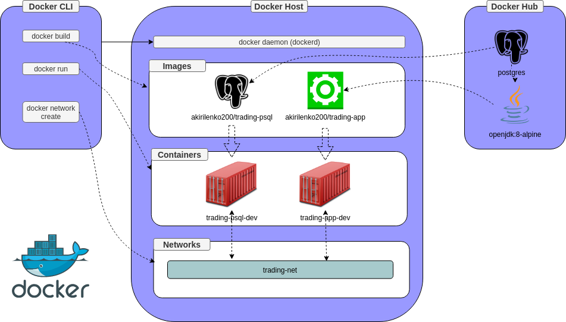

#Table of contents
* [Introduction](#introduction)
* [Quick Start](#quick-start)
* [Implementation](#implemenation)
* [Test](#test)
* [Deployment](#deployment)
* [Improvements](#improvements)

# Introduction 
The _Jarvis Trading App_ is a proof of concept trading platform that is 
designed as a microservice and is aimed at replacing the existing legacy system.
The application presents a REST API that can be consumed by front-end applications
allowing clients to interactively manage their accounts, portfolios, and trade securities.

This project is developed in Java using the Springboot framework for object lifecycle management (IoC)
and processing of requests using in-built Tomcat HTTP server. 
Additionally, object-relational mapping and data persistence are accomplished using the Hibernate framework.
The project lifecycle and dependencies are managed using Maven 
and the final application is packaged and distributed as docker images.

# Quick Start
To run the application it is necessary to have Docker installed. 
The recommended way to use the app is to pull the images from the docker hub:
```shell
docker pull akirilenko200/trading-psql
docker pull akirilenko200/trading-app
```
Alternatively, the docker images can be built manually from the Dockerfiles provided in `/psql` and `/` directories,
using the [instructions.](https://github.com/jarviscanada/jarvis_data_eng_AlexKirilenko/tree/master/core_java/twitter#deployment)

To isolate the application, a bridge network is created:
```shell
docker network create trading-net
```
The PostgreSQL image is run:
```shell
docker run --name trading-psql-dev \
-e POSTGRES_PASSWORD=${PSQL_PASSWORD} \
-e POSTGRES_DB=${PSQL_DB} \
-e POSTGRES_USER=${PSQL_USER} \
-v tradingData:/var/lib/postgresql/data \
--network trading-net \
-d akirilenko200/trading-psql
```
where `tradingData` is a docker volume used for persistence.
Next, the application image is run:
```shell
docker run --rm --name trading-app-dev \
-e "PSQL_HOST=trading-psql-dev" \
-e "PSQL_PORT=${PSQL_PORT}" \
-e "PSQL_DB=${PSQL_DB}" \
-e "PSQL_USER=${PSQL_USER}" \
-e "PSQL_PASSWORD=${PSQL_PASSWORD}" \
-e "IEX_PUB_TOKEN=${IEX_PUB_TOKEN}" \
--network trading-net \
-p 8080:8080 \
-t akirilenko200/trading-app
```
The environment variable `$IEX_PUB_TOKEN` is a token obtained from the IEX cloud service.

Finally, the application can be used through Postman or [SwaggerUI](http://localhost:8080/swagger-ui.html):


# Implemenation
## Architecture
The application has the MVC architecture, with separation of responsibilities
between the layers responsible. 

- Controller layer: handles user requests by mapping the REST endpoints 
  to the related business logic methods and sending responses.
- Service layer: processes the business logic of the requests and queries the data access layer 
  for storage and retrieval of data. 
- DAO layer: maps Java objects to the relational database and executes queries. 
- SpringBoot: manages the object lifecycle (IoC) and provides Tomcat Webservlet to handle HTTP requests and send responses.
- Hibernate: maps Java objects to the relational database (ORM) and enables persistence.
- PostgreSQL: provides an implementation of the database.
- IEX: provides the access for market data.

## REST API Usage
### Swagger
Swagger is used to automatically generate a browser UI to interact with the REST endpoints.
It can be used by developers and testers to easily interact with the application.

### Quote Controller

Quote Controller provides endpoints to interact with the stock tickers by  
synchronizing with IEX cloud and providing local persistence:
- `GET /quote/dailyList`: lists all stock quotes added to the daily list
- `GET /quote/iex/ticker/{ticker}`: shows IEX quote for a given ticker
- `POST /quote/tickerId/{tickerId}`: adds new ticker to the list
- `PUT /quote/`: adds a quote directly to the database
- `PUT /quote/iexMarketData`: updates all quotes in the list with the most recent data from IEX

### Trader Controller
Trader controller provides endpoints to create and delete trader profiles and manage their accounts:
- `DELETE /trader/traderId/{traderId}`: deletes a trader profile and account with given id
- `POST /trader/`: creates a new trader profile and account from provided JSON
- `POST /trader/firstname/{firstname}/lastname/{lastname}/dob/{dob}/country/{country}/email/{email}`:
  creates a new trader profile and account from provided URL parameters
- `PUT /trader/deposit/traderId/{traderId}/amount/{amount}`: deposits a given ammount into trader's account
- `PUT /trader/withdraw/traderId/{traderId}/amount/{amount}`: withdraws a given ammount from trader's account

# Test
To ensure the correctness of the application, integration tests were written for
all DAO and Service layer classes using JUnit library.
Additionally, for each test, a testing environment including a replica of the database 
was configured using Spring test utilities.
As a result, the code coverage is 95% for classes and 75% for lines.
Finally, Postman was used to manually test all of the REST API endpoints.

# Deployment

1. The images of the psql server and application are built from dockerfiles. 
   Additionally, the psql database is initialized by copying `.sql` initialization files into `/docker-entrypoint-initdb.d/` directory.  
2. Bridge network is created to provide encapsulated communication.
3. Images are run into containers and are connected to the created network.
4. The application is ready to be [used](#quick-start).
# Improvements
1. Migrate from the legacy database into the implementation-agnostic approach using Hibernate ORM.
2. Utilize docker compose for easier building and deployment.
3. Add security and authorization services to the application.
4. Add endpoints for the historical and analytical queries.